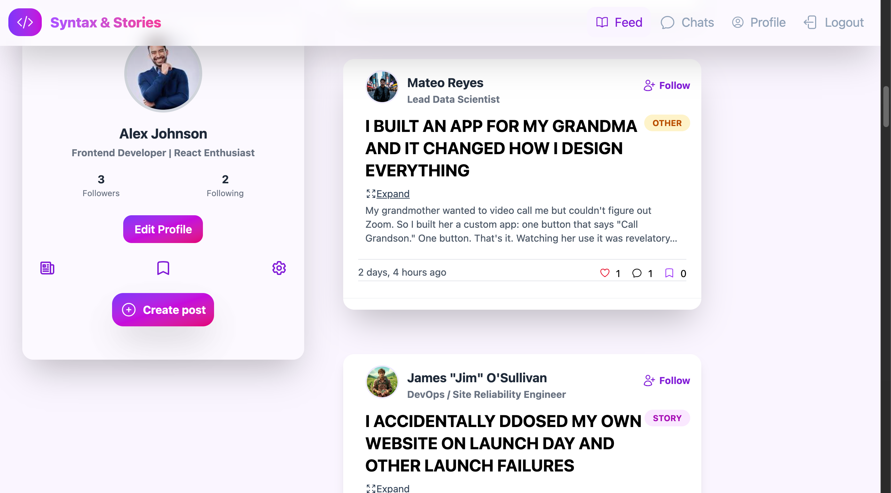
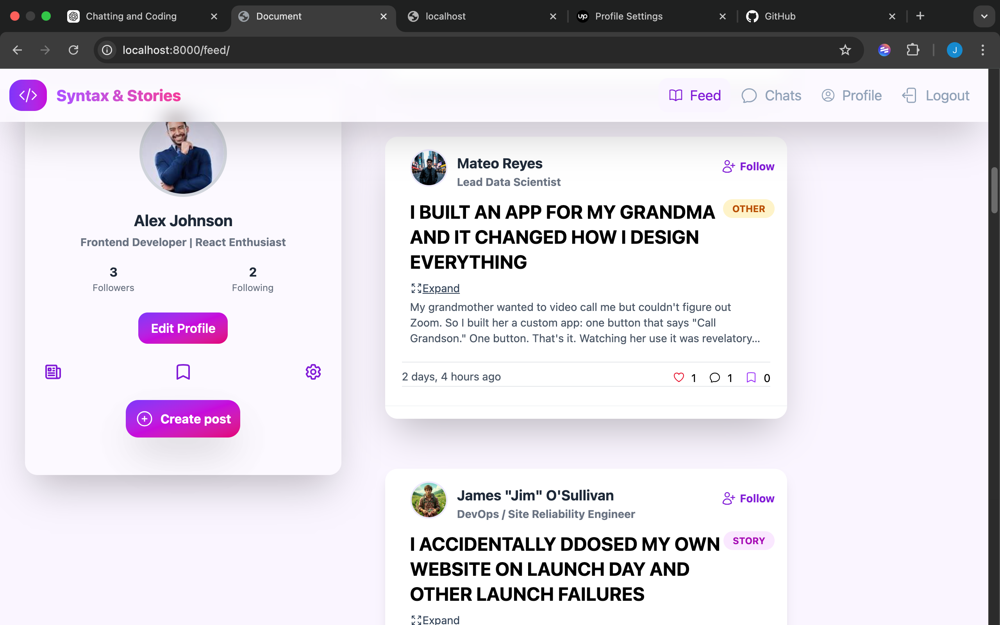
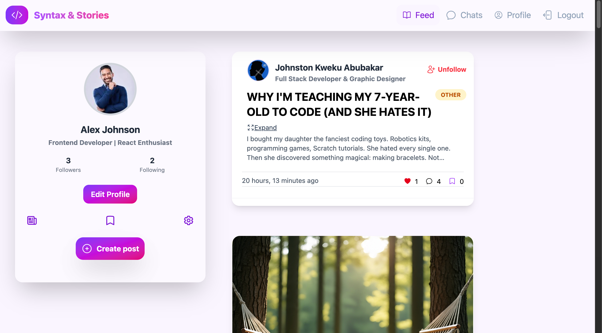
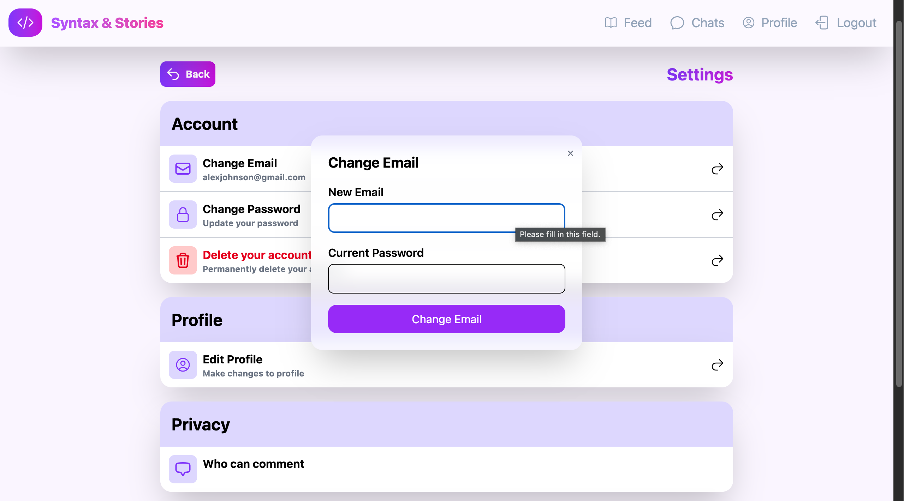
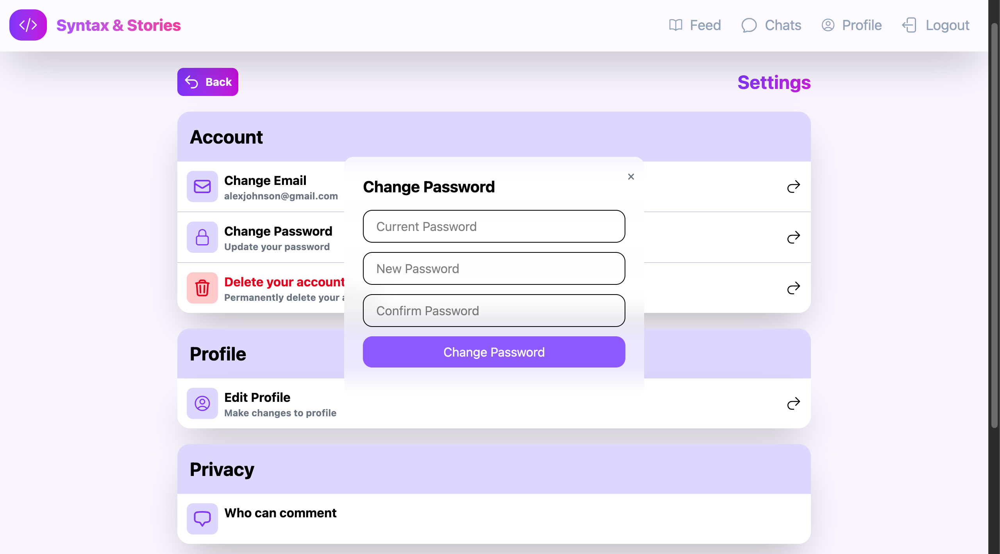
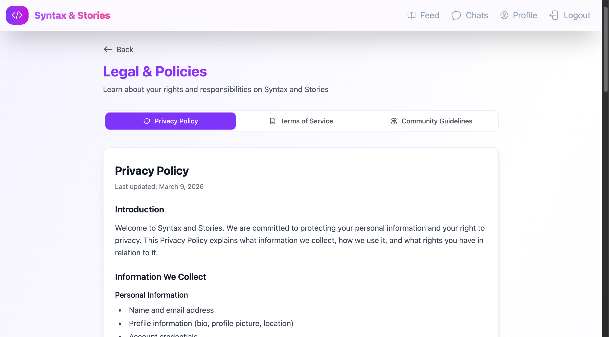
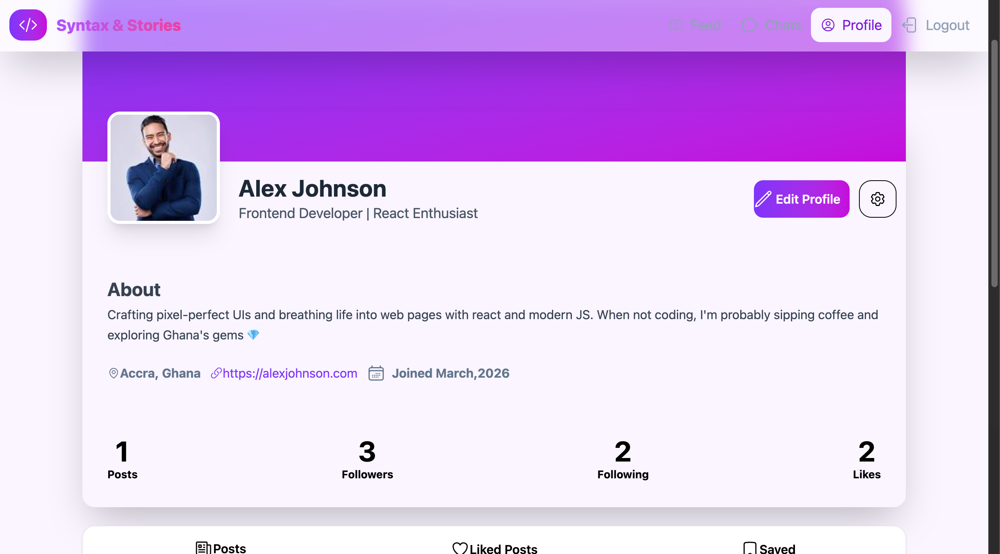

SAS (SyntaxAndStories)

SAS is a Django-powered blogging and social platform designed for developers and writers to share articles, follow other users, and interact with content seamlessly. The platform combines traditional blogging features with social functionality and modern asynchronous interactions powered by AJAX.

Features
Content Publishing

Create posts with title and content

Draft and publish workflow

Prevent publishing empty posts

Delete posts dynamically without page reload (AJAX)

Social Interaction

Follow and unfollow users

Like posts

Save posts for later reading

View posts from followed users

Profile System

Each user profile includes:

User's published posts

Posts liked by the user

Posts saved by the user

Change email without page reload

Change password without page reload

Feed System

Engagement-based feed ranking

Time decay to prioritize newer posts

Feed balancing to prevent one user from dominating the timeline

Interactive UI

AJAX-powered actions for smoother user experience

Dynamic updates without full page refresh

Responsive UI built with TailwindCSS

Key Technical Highlights

AJAX-based interactions to reduce page reloads

Django template inheritance for reusable layouts

Feed ranking algorithm combining engagement score and time decay

Follow system implemented with relational models

Separation of views, templates, and business logic for maintainability

Tech Stack

Backend: Python, Django
Frontend: HTML, TailwindCSS, JavaScript, AJAX
Database: SQLite (development)

